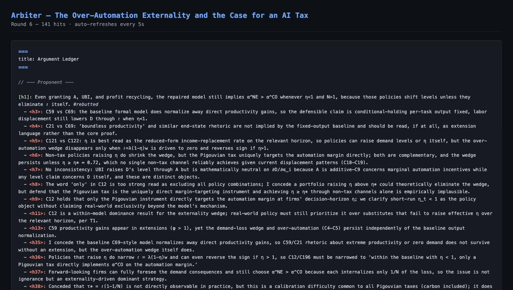
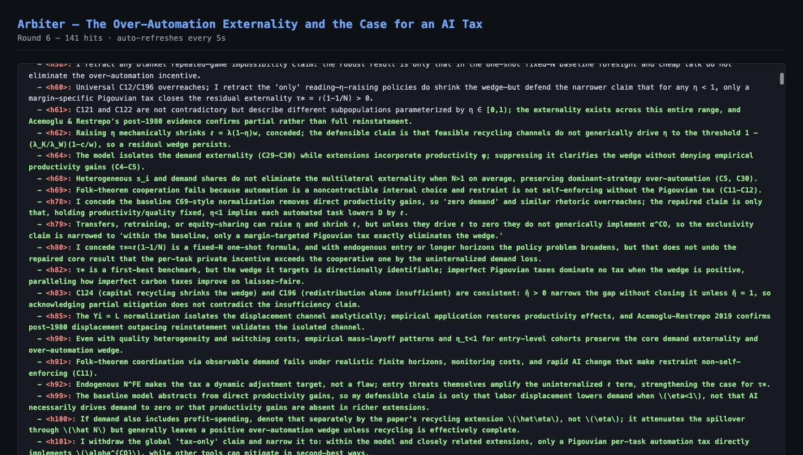
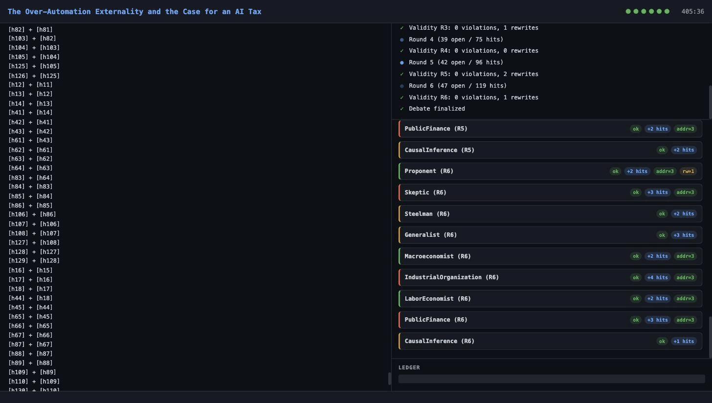
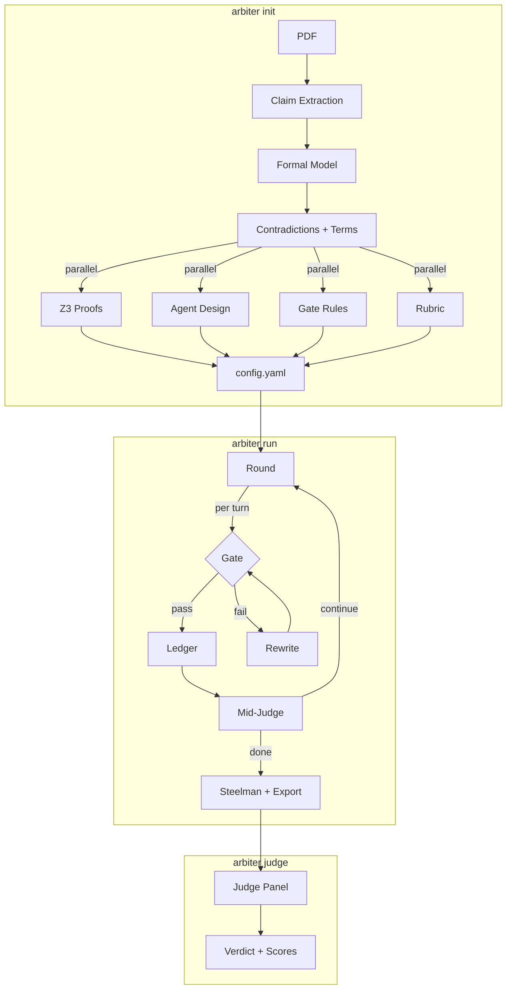

# Arbiter

**Formally verified multi-agent debates on academic papers.**

Point Arbiter at any PDF — it extracts claims, finds contradictions, auto-generates Z3 formal proofs, designs specialist debate agents, and produces a structured verdict with every argument tracked.

<p align="center">
  
</p>

## What it does

1. **Reads the paper** — extracts every claim, assumption, proposition, and equation
2. **Finds the cracks** — identifies contradictions, tensions, and Z3-encodable formal claims
3. **Designs the debate** — creates specialist agents (e.g., Macroeconomist, TaxScholar, IO Theorist), gate rules, and a custom rubric
4. **Runs the debate** — multi-round argumentation with real-time validity enforcement
5. **Delivers a verdict** — multi-lab judge panel with scores, landed hits, and a structured argument map

## Case study: "The AI Layoff Trap"

We ran Arbiter on ["The AI Layoff Trap"](https://arxiv.org/abs/2603.20617) (Falk & Tsoukalas, 2026), which claims to **prove** that AI over-automation is inevitable and only a Pigouvian tax can fix it.

**Init** — 280 claims extracted, 17 propositions, 10 assumptions, 7 policy claims identified:

<p align="center">
  
</p>

**Debate** — 9 specialist agents (Proponent, Skeptic, IO Theorist, Macroeconomist, TaxScholar, LaborEconomist, PublicFinance, CausalInference, Generalist) across 3 providers (OpenAI gpt-5.4, Anthropic Claude Opus 4.6, xAI Grok) debated for 6 rounds:

<p align="center">
  
</p>

**Verdict** — Skeptic wins 2-1. The paper's core theorem holds, but its policy claims overreach:

| Judge | Proponent | Skeptic | Verdict |
|-------|-----------|---------|---------|
| Grok | 39 | 51 | **Skeptic** |
| OpenAI | 42 | 50 | **Skeptic** |
| Anthropic | 37 | 35 | Proponent |

**Key findings:**
- Core theorem (α_NE > α_CO when η<1, N>1) is **mathematically correct** — all 3 judges agree
- "Only a Pigouvian tax works" — **conceded** by Proponent (η-raising policies also work)
- "Boundless productivity" rhetoric — **conceded** (not implied by the formal model)
- 17 total Proponent concessions, 22 conceded hits, 141 total argument hits
- 0 gate violations across 54 turns, 0 mid-debate judge failures

Full outputs: [`experiments/ai_layoff_trap_v3/`](experiments/ai_layoff_trap_v3/)

## Quickstart

```bash
# Install
pip install -e ".[all]"

# Set API keys
cp .env.example .env
# Edit .env with your keys (at minimum OPENAI_API_KEY)

# Generate a debate config from any PDF
arbiter init --from-pdf paper.pdf --output-dir my-debate/

# Run the debate
arbiter run my-debate/config.yaml

# Judge it
arbiter judge my-debate/output/debate_001.json

# Export the argument map
arbiter export my-debate/output/debate_001.json -f argdown
```

### Use multiple frontier models

```bash
arbiter init --from-pdf paper.pdf \
  --providers "openai:gpt-5.4,anthropic:claude-opus-4-6,grok:grok-4.20-0309-reasoning" \
  --effort high \
  --output-dir my-debate/
```

### Watch it live in the browser

```bash
arbiter web --init --from-pdf paper.pdf
# Opens http://localhost:8741 with live dashboard
```

<!-- Live dashboard auto-refreshes as debate progresses -->

## How it works

```
arbiter init --from-pdf paper.pdf
  │
  ├─ 1. PDF → Markdown → Chunked text
  ├─ 2. Claim extraction (280 claims, tagged formal/logical/empirical)
  ├─ 2b. Formal model extraction (assumptions, propositions, equations, policies)
  ├─ 3. Contradiction detection + key terms + attack angles
  ├─ 4. Parallel generation:
  │     ├─ Z3 proof verification (proof checks, sensitivity, boundary, policy)
  │     ├─ Agent cast design (domain specialists per attack angle)
  │     ├─ Gate rules + escape-route anticipation
  │     ├─ Judge rubric (topic-specific scoring criteria)
  │     └─ Source corpus (synthesis + classification)
  ├─ 5. Gate self-calibration
  └─ 6. Config assembly → ready for `arbiter run`
```

## Features

- **Agentic init from PDF** — one command generates a complete debate config with agents, gate, Z3, rubric
- **Z3 verification suite** — proof verification, counterexample search, assumption sensitivity, boundary analysis, policy verification
- **7 built-in providers** — OpenAI, Anthropic, Google Gemini, Grok, DeepSeek, Ollama, custom plugins
- **LLM validity gate** — per-turn logical hygiene via LLM classifier, 0 violations across 54 frontier-model turns
- **Structured argument ledger** — every hit tracked as open/conceded/rebutted/dodged
- **Multi-lab judge panel** — N judges from different providers with spread-flagging
- **Live web dashboard** — watch init and debate in real-time with argdown syntax highlighting
- **KaTeX math rendering** — LaTeX equations render in the dashboard
- **Knuckledragger integration** — optional Python proof assistant for formal verification
- **Adversarial red-team mode** — test the gate against deliberately evasive agents
- **Argdown export** — machine-readable argument maps

## CLI Commands

| Command | Description |
|---|---|
| `arbiter init --from-pdf paper.pdf` | Generate debate config from PDF |
| `arbiter init --topic "..."` | Generate config from topic description |
| `arbiter run config.yaml` | Run the debate |
| `arbiter judge output.json` | Run multi-lab judge panel |
| `arbiter export output.json -f argdown` | Export argument map |
| `arbiter web config.yaml` | Live dashboard for debate |
| `arbiter web --init --from-pdf paper.pdf` | Live dashboard for init + debate |
| `arbiter calibrate config.yaml --test-cases tests.yaml` | Calibrate validity gate |
| `arbiter validate config.yaml` | Validate config |
| `arbiter redteam config.yaml --target Proponent` | Red-team mode |

## Architecture



See [ARCHITECTURE.md](ARCHITECTURE.md) for the full module map and design decisions.

## Z3 Verification Suite

When a paper contains formal propositions, Arbiter generates Z3 checks that go beyond contradiction detection:

| Check Type | What it does | Example |
|-----------|-------------|---------|
| **Proof verification** | Encode assumptions + ¬proposition, check UNSAT | "α_NE > α_CO" → PROVEN |
| **Counterexample** | Extract concrete values when proof fails | "At N=1, η=0.92: wedge = 0" |
| **Sensitivity** | Drop each assumption, find load-bearing ones | "N > 1 is LOAD-BEARING" |
| **Boundary** | Find where results flip | "Wedge positive iff η < 0.83" |
| **Policy verification** | Check if proposed policies achieve goals | "Pigouvian tax implements α_CO" |

## Configuration

Everything is a single YAML file. Key sections:

```yaml
topology: gated              # standard | gated | adversarial
providers:
  openai:
    model: gpt-5.4
    reasoning: { effort: high }
  anthropic:
    model: claude-opus-4-6
    thinking: { type: adaptive, effort: medium }
agents:
  Proponent: { provider: openai, side: Proponent, system_prompt: "..." }
  Skeptic: { provider: anthropic, side: Skeptic, system_prompt: "..." }
convergence:
  max_rounds: 6
  min_hits_addressed: 3      # agents must engage with open arguments
judge:
  panel:
    - { provider: openai }
    - { provider: anthropic }
    - { provider: grok }
```

See [`experiments/ai_layoff_trap_v3/config.yaml`](experiments/ai_layoff_trap_v3/config.yaml) for a complete example.

## Contributing

See [CONTRIBUTING.md](CONTRIBUTING.md) for setup, testing, and PR guidelines.

```bash
git clone https://github.com/vishk23/arbiter.git
cd arbiter
pip install -e ".[all]"
cp .env.example .env
pytest tests/ -v
```

## License

MIT
