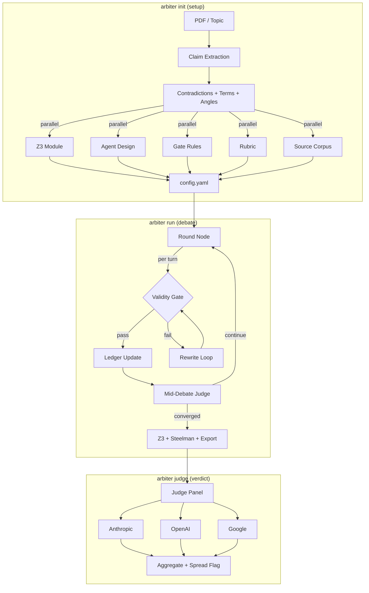

# Arbiter

**Formally verified multi-agent debates.**

Run structured debates between frontier LLMs with optional Z3 formal verification, calibrated validity gates, and multi-lab judging panels.

## Install

```bash
pip install -e ".[all]"
```

## Quickstart

```bash
# Set your API key
export OPENAI_API_KEY=sk-...

# Run a 3-agent debate
arbiter run configs/quickstart.yaml
```

## Generate a config from a PDF

```bash
# Set API keys
export ANTHROPIC_API_KEY=...
export OPENAI_API_KEY=...

# Point Arbiter at any paper — it extracts claims, finds contradictions,
# generates Z3 constraints, designs agents, and builds a complete config
arbiter init --from-pdf paper.pdf --output-dir my-debate/

# Or use multiple frontier models for higher quality
arbiter init --from-pdf paper.pdf \
  --providers "openai:gpt-5.4,anthropic:claude-opus-4-6,gemini:gemini-3.1-pro-preview"

# Fast init (skip gate self-calibration)
arbiter init --from-pdf paper.pdf --skip-calibration

# Or start from a topic description
arbiter init --topic "Does consciousness require integrated information?"
```

## CLI Commands

### Core workflow

| Command | Description |
|---|---|
| `arbiter init` | Generate a debate config from a PDF or topic (agentic, LLM-powered) |
| `arbiter run config.yaml` | Run a debate |
| `arbiter judge output.json --config config.yaml` | Run multi-lab judge panel |
| `arbiter export output.json -f argdown` | Export argument map (argdown/markdown/json) |

### Advanced

| Command | Description |
|---|---|
| `arbiter calibrate config.yaml --test-cases tests.yaml` | Calibrate validity gate (recall/specificity) |
| `arbiter validate config.yaml` | Validate config file with helpful error messages |
| `arbiter show-rubric config.yaml` | Display judge rubric as formatted table |
| `arbiter redteam config.yaml --target Proponent` | Run with one agent deliberately trying to evade the gate |

### Config management

| Command | Description |
|---|---|
| `arbiter list-agents config.yaml` | Show all agents with roles and providers |
| `arbiter add-agent config.yaml -n JungScholar -s Skeptic -d "Jungian psychology"` | Add an agent with LLM-generated prompt |
| `arbiter remove-agent config.yaml -n JungScholar` | Remove an agent |
| `arbiter init --template` | Generate a blank starter config |

## Features

- **Agentic setup** — point at a PDF, get a complete debate config with Z3 constraints, gate rules, agent prompts, and rubric
- **7 providers built-in** — Anthropic, OpenAI, Google Gemini, Grok, DeepSeek, Ollama, custom plugins. Mix models freely across agents and judges
- **Pydantic-first structured output** — 23 typed schemas, provider-native parsing (OpenAI `responses.parse`, Anthropic tool-use, Gemini `response_schema`)
- **Z3 formal verification** — optional SMT solver plugin proves claims are self-consistent
- **LLM-primary validity gate** — per-turn logical hygiene via LLM classifier (100% recall/specificity on gold-standard), with optional regex + Z3 layers
- **Structured argument ledger** — every hit tracked as open/conceded/rebutted/dodged
- **Convergence detection** — debate halts when no new arguments surface
- **Multi-lab judge panel** — N judges from different providers, with spread-flagging for disagreement
- **Adversarial red-team** — test the gate against a deliberately evasive agent
- **Argdown export** — machine-readable argument maps
- **Side-balanced provider assignment** — each debate side gets agents from multiple labs

## Architecture



See [ARCHITECTURE.md](ARCHITECTURE.md) for the full module map, data flow trace, design decisions, and known technical debt.

## How it works

```
arbiter init --from-pdf paper.pdf
  │
  ├─ 1. PDF → Markdown (pymupdf4llm)
  ├─ 2. Claims extraction (LLM structured output)
  ├─ 3. Contradiction detection + key terms + attack angles
  ├─ 3b. Claim consolidation (140 raw → 9 core theses)
  ├─ 4. Parallel generation:
  │     ├─ Z3 constraint module (auto-generated + self-tested)
  │     ├─ Agent cast design (specialists per attack angle)
  │     ├─ Gate rules + escape-route anticipation
  │     ├─ Judge rubric (topic-specific criteria)
  │     └─ Source corpus (web search + classification)
  ├─ 5. Gate self-calibration (generate tests → check → fix weak patterns)
  └─ 6. Config assembly + validation
       → config.yaml ready for `arbiter run`
```

## Config format

Everything is a single YAML file. See `configs/quickstart.yaml` for a minimal example or `experiments/bit_creation_theory/config.yaml` for a full setup with Z3, gate, and 10+ agents.

Key sections: `topic`, `topology`, `token_budgets`, `providers`, `agents`, `convergence`, `gate`, `z3`, `judge`, `steelman`, `retrieval`, `output`.

### Token budgets

All LLM call token limits are configurable per deployment:

```yaml
token_budgets:
  small: 1500       # classification, checks, guidance
  medium: 4000      # extraction, key terms
  large: 8000       # agent design, Z3 gen, gate rules
  xl: 16000         # document extraction, judge verdicts
  thinking_overhead: 16000  # extra tokens when thinking/reasoning is on
```

### Provider thinking/reasoning

```yaml
providers:
  anthropic:
    model: claude-opus-4-6
    thinking:
      type: adaptive        # recommended (model decides depth)
      effort: medium         # low/medium/high/max
  openai:
    model: gpt-5.4
    reasoning:
      effort: high           # none/minimal/low/medium/high/xhigh
  gemini:
    model: gemini-3.1-pro-preview
    thinking:
      thinking_level: HIGH   # MINIMAL/LOW/MEDIUM/HIGH (Gemini 3.x)
```

## Case study: BIT Creation Theory

Arbiter was developed during an 8-posture experimental analysis of BIT Creation Theory (Torres, 2026). The experiment produced a **24-0 unanimous verdict** across 24 LLM judges from 3 labs (Anthropic Claude Opus, OpenAI gpt-5, Google Gemini 3.1 Pro).

Key findings:
- Z3 mechanically proved the theory's formal claims are self-contradictory (UNSAT)
- The validity gate achieved 100% operational catch rate on unwitting violations
- When red-teamed, the gate caught the adversary's evasion attempts and deterred further violations
- Frontier LLMs independently discovered the formal contradiction without being told
- The agentic init pipeline found 6 contradictions that 8 hours of manual analysis missed

Full data and configs: `experiments/bit_creation_theory/`

## License

MIT
